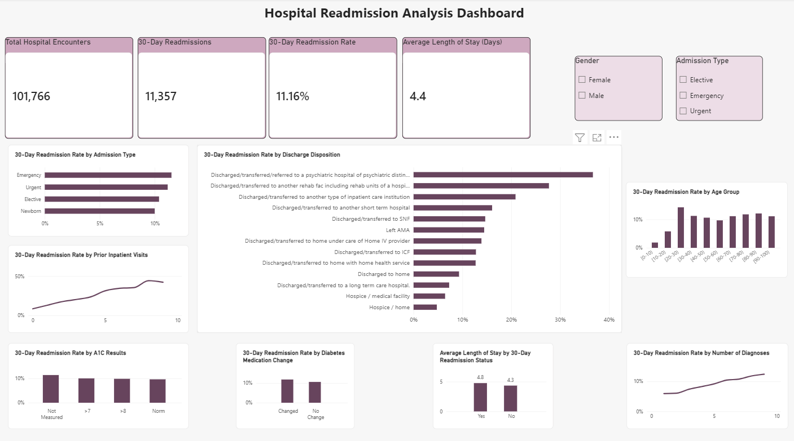

# Hospital Readmission Analysis

## Project Overview
This healthcare analytics project examines hospital encounter data to identify patterns associated with 30-day readmissions and support data-driven healthcare decision-making.

## Tools Used
- Power BI
- Python
- pandas
- Jupyter Notebook

## Key Metrics
- Total Hospital Encounters: 101,766
- 30-Day Readmissions: 11,357
- 30-Day Readmission Rate: 11.16%
- Average Length of Stay: 4.4 days

## Analysis
The dashboard examines readmission patterns across admission type, discharge disposition, age group, gender, prior inpatient visits, and medication changes.

Interactive KPI cards, slicers, and visualizations were created in Power BI to make healthcare trends easier to identify and communicate.

## Dashboard Preview

## Portfolio Note
This repository is a public portfolio showcase. Full working files and development materials are maintained separately.
